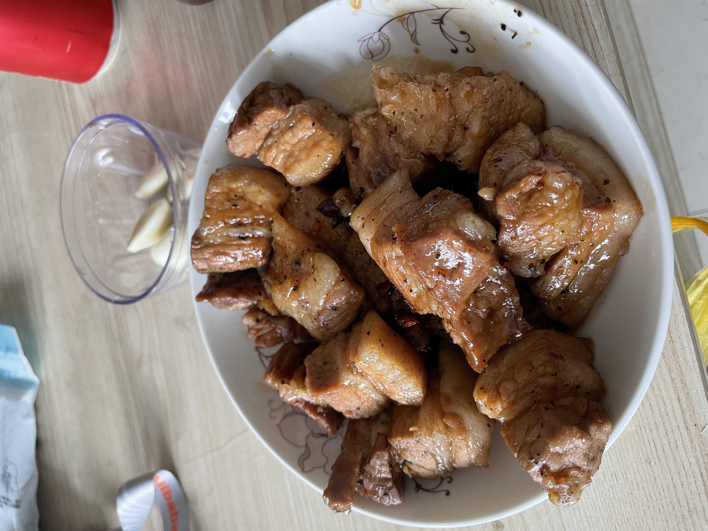
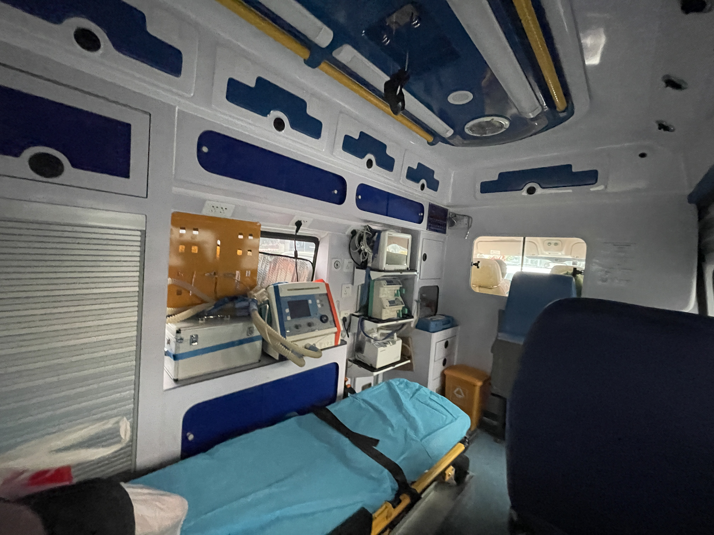
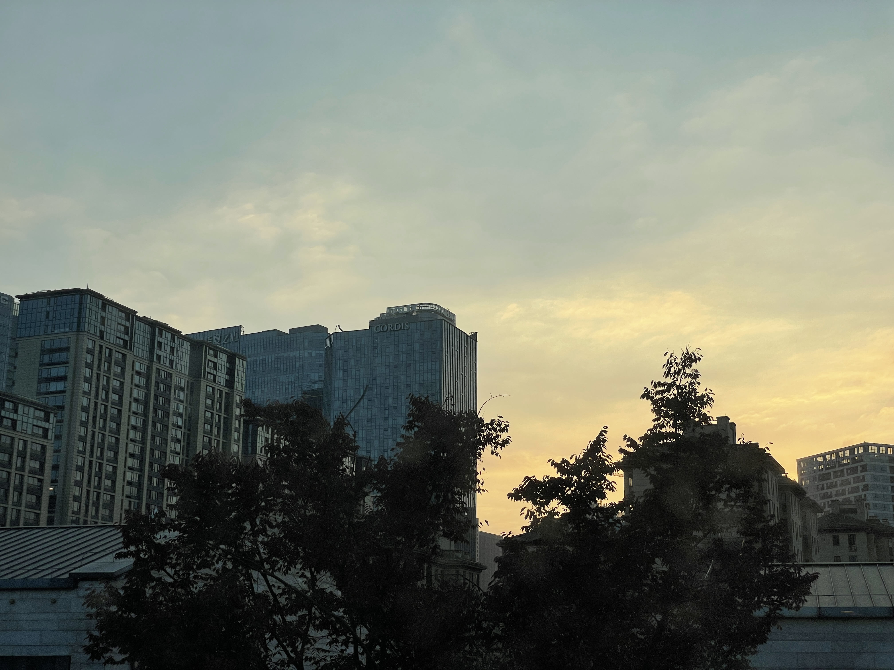
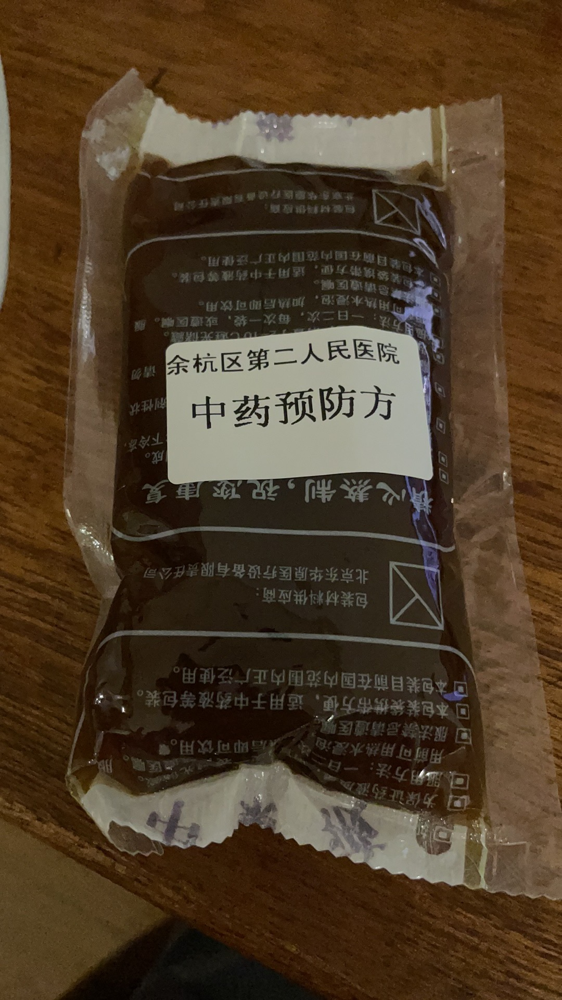
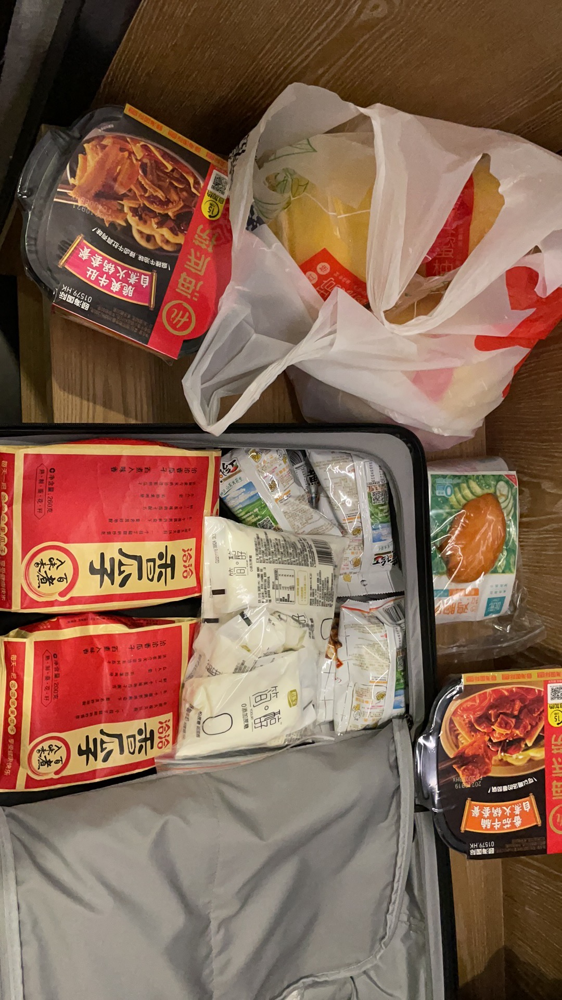

# 2021-11-27
很巧的，我作为次密接，被隔离了。想到这段经历很有意思，可能到死了的那一天会回忆一下，所有决定记下来。
默默的想了一下，中国的几次疫情我貌似都被隔离过。大学的时候，禽流感爆发了，我不幸的发烧了，于是我就被隔离了。隔离在学校的旧宿舍中。我半夜还锁门了，第二天被护士姐姐批评了。后来回了宿舍，同学逗我说，怕我死在里面。现在想想挺好儿的。
然后在去年也是这个时候，由于去保定出差，当时北京有疫情，所以我就从杭州飞到了张家口，然后坐火车去的保定。后来张家口疫情爆发了，于是我就被公司要求在家办公14天。一脸懵逼。
今天，我由于离密接同学比较近，我成为了次密接，于是我又被集中隔离了，隔离点离家还挺近的，其实走路也只有10分钟。
被带走之前，我给我做了一顿红烧肉。

然后就坐上救护车到就点了，其实没有明白10分钟的路程为什么要坐救护车。

到了酒店，发现还不错。可以直接看到康得思。

隔离点还给配置了中药包，一天一包，说是有预防疗效，而且可以强身健体。

幸好有好心姐姐和我讲了要带零食，所以这就是我7天的口粮零食。就靠牛奶和鸡胸肉来保证蛋白质了。

想到后续几天还要这么过。决定给自己制定一个计划，打个卡。所以列了一下。

- [ ] 早上1轮波比跳
- [ ] 早上10*5俯卧撑
- [ ] 晚上1轮波比跳
- [ ] 晚上10*5俯卧撑
- [ ] 10点前睡觉
- [ ] 8点起床

# 2021-11-28

早饭还是比较丰盛的，我说了我不够吃，工作人员非常敬业，直接送了3份给我。

昨天睡的还不错，我被隔离后，我有位朋友还反复确认我的健康状况，甚是感动。
> 儿子，如果你长到了，请珍惜身边的每一位挚友。这次是你真正的财富。

- [X] 8点起床
- [x] 早上靠墙蹲2*1min
- [x] 早上俯卧撑5*10